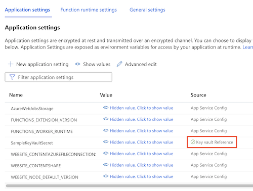

# Key vault with private endpoint, and a Linux function app with a Key Vault reference

This sample shows how to use Bicep to create the following:

- Key vault with a secret.
  - Private endpoint and firewall configuration to disallow public network connectivity to the vault.
- Linux function plan, using the elastic premium tier.
- Function app.
  - [Key Vault reference](https://docs.microsoft.com/azure/app-service/app-service-key-vault-references) pointing to the secret in the vault.
  - Managed identity, which is granted access to read secrets within the vault.

After you deploy the sample, you can verify the Key Vault reference works by opening the Azure portal, navigating to the function app, and selecting the **Configuration** page. The **SampleKeyVaultSecret** configuration should be listed with a green checkmark:

A sample function that shows how to use the Key Vault reference is in the **deploy/function/function.csx** file. The function is not deployed and is just provided for reference..
